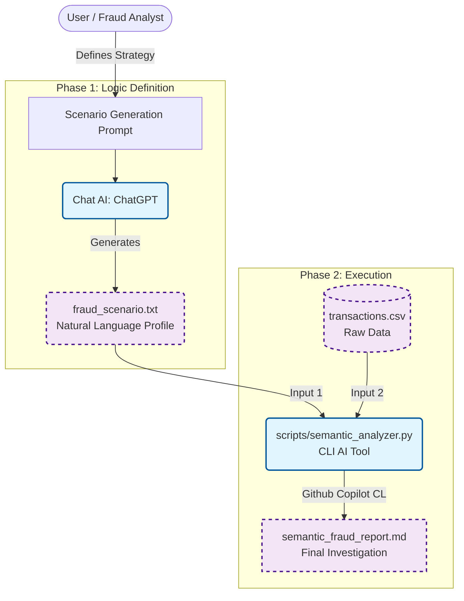

# Capstone Project: Automated Semantic Fraud Detection

**Author:** Courage Dei  
**Course:** Applied AI & Prompt Engineering  


## Project Overview
This project implements a **Multi-Stage AI Workflow** designed to automate the detection of fraudulent financial transactions using **Semantic Analysis**. 

This pipeline uses:
1.  **Chat AI (ChatGPT):** To generate a qualitative **Forensic Profile** of a specific fraud pattern.
2.  **CLI AI (Gemini):** To scan raw transaction data and **semantically match** user behavior to that profile.

This demonstrates a "Chain of Thought" workflow where the *logic* is defined by one AI and *executed* by another, removing the need to write hard-coded SQL queries for every new fraud trend.

---

## Workflow Diagram



---

## The "Meaningful AI" Difference
In the previous version, the AI merely wrote SQL code, and the Database did the work. In this remediated version:
*   **True AI Logic:** The criteria for fraud are not hard-coded (e.g., `amount > 5000`). They are semantic (e.g., *"small test purchases followed by a large extraction"*).
*   **Adaptability:** To detect a different type of fraud, you only change the *Scenario Text*—no code changes required.

---

## Setup & Execution

### Prerequisites
*   Python 3.x

### 1. Logic Generation (Chat AI)
We used ChatGPT to generate the fraud profile.
*   **Prompt:** *[See scenario_generation_prompt.md](scenario_generation_prompt.md)*
*   **Output:** *[See fraud_scenario.txt](fraud_scenario.txt)*

### 2. Run the Semantic Analyzer (CLI AI)
Execute the custom Python script to find the fraudster.

```bash
python scripts/semantic_analyzer.py --scenario fraud_scenario.txt --data csvs/transactions.csv
```

### 3. Review the Output
The system will generate `semantic_fraud_report.md` identifying the specific user who matches the profile.

---


