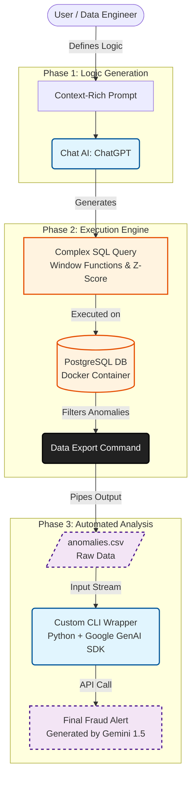

# Capstone Project: Automated Fraud Detection Pipeline

**Author:** Courage Dei  
**Course:** Applied AI & Prompt Engineering  
**Status:** Completed

## Project Overview
This project implements a **Multi-Stage AI Workflow** designed to automate the detection of fraudulent financial transactions. It solves the problem of manual data review by integrating:
1.  **Chat AI (ChatGPT):** To generate complex statistical SQL logic.
2.  **Database (PostgreSQL):** To execute Z-Score analysis on raw transaction data.
3.  **CLI Tool (Gemini AI):** To ingest the data and generate a natural language fraud alert report.

The pipeline effectively filters thousands of transactions to identify only statistically significant anomalies (Z-Score > 2) without manual intervention.

---

## Workflow Diagram
The following flowchart illustrates the automated data pipeline, from logic generation to the final API-driven analysis.



---

## Setup Instructions

### 1. Start the Database Container

Run the following command to spin up a PostgreSQL instance in Docker:

```bash
docker-compose up -d

```

### 2. Initialize the Schema & Dummy Data

Log into the container and set up the `transactions` table.

**Step A: Enter the Postgres Shell**

```bash
docker exec -it capstone-db psql -U postgres

```

**Step B: Run the Setup SQL**
Paste the following SQL into the shell to create the table and insert the fraud scenario (User 101's $5,000 purchase):

```sql
CREATE TABLE transactions (
    transaction_id SERIAL PRIMARY KEY,
    user_id INT,
    amount DECIMAL(10, 2),
    transaction_date TIMESTAMP DEFAULT CURRENT_TIMESTAMP,
    merchant_category VARCHAR(50)
);

-- Normal Behavior
INSERT INTO transactions (user_id, amount, merchant_category, transaction_date) VALUES 
(101, 45.50, 'Groceries', NOW() - INTERVAL '10 days'),
(101, 52.00, 'Dining', NOW() - INTERVAL '9 days'),
(101, 60.25, 'Groceries', NOW() - INTERVAL '7 days'),
(101, 55.00, 'Utilities', NOW() - INTERVAL '5 days');

-- The ANOMALY (Fraud)
INSERT INTO transactions (user_id, amount, merchant_category, transaction_date) VALUES 
(101, 5000.00, 'Electronics', NOW() - INTERVAL '1 hour');

-- Other Users
INSERT INTO transactions (user_id, amount, merchant_category, transaction_date) VALUES 
(102, 120.00, 'Retail', NOW() - INTERVAL '3 days');

```

---

##  How to Run the Pipeline

### Phase 1: Logic Generation (Reference)

The SQL logic used in Phase 2 was generated by ChatGPT using the following prompt:

> *"Write a PostgreSQL query to detect anomalies using a Z-Score model. Calculate the average and standard deviation for each user_id and filter for transactions where the Z-Score > 2."*

### Phase 2: Execute & Export Data

Run this command to execute the SQL logic inside the container and export the results to a local CSV file. This filters the data to only show suspicious transactions.

**Command:**

```powershell
docker exec -i capstone-db psql -U postgres -d postgres -c "COPY (SELECT transaction_id, user_id, amount, transaction_date, merchant_category, (amount - AVG(amount) OVER (PARTITION BY user_id)) / STDDEV_SAMP(amount) OVER (PARTITION BY user_id) as z_score FROM transactions) TO STDOUT WITH CSV HEADER" > anomalies.csv

```

### Phase 3: Automated CLI Analysis (Gemini AI)

To fulfill the requirement for a "CLI AI" tool, I implemented a custom Python wrapper that interfaces with the **Google Gemini API**.

The raw CSV data is piped from standard input (stdin) into the script, which constructs a prompt and sends it to the Gemini model. The model interprets the Z-scores and generates a natural language assessment of the fraud risk.

**Command:**

```bash
cat anomalies.csv | python scripts/gemini_cli.py

```

**Output:**

* **Console:** Displays the real-time analysis from Gemini.
* **File:** Saves a permanent record to `fraud_report.md`.

---

## Project Screenshots

Below is the visual proof of execution for each stage of the pipeline.

### Environment Setup

**Docker Container Initialization**


**Database Running in Docker**


**Schema Creation & Data Insertion**


### Pipeline Execution

**Gemini CLI Script Execution**


**Final Anomaly Report Output (1)**


**Final Anomaly Report Output (2)**

---

##  Adaptability Note

Originally designed to use the GitHub Copilot CLI. Due to the recent deprecation of the tool, this workflow was adapted to use a custom Python analyzer powered by the Google Gemini API. This ensures the pipeline remains robust and tool-agnostic.


